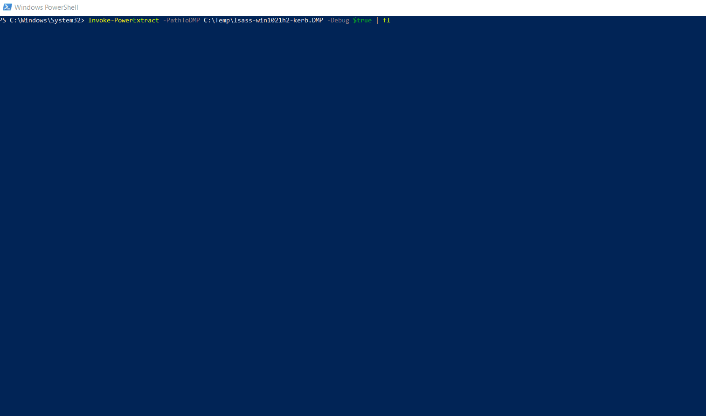

# Invoke-PowerExtract

This tool is able to parse memory dumps of the LSASS process without any additional tools (e.g. Debuggers) or additional sideloading of mimikatz. It is a pure PowerShell implementation for parsing and extracting secrets (LSA / MSV and Kerberos) of the LSASS process.

Important: The script holds no functionality to create dump files - it will just read them.

# Usage 

So you just want to read a created dump file? The usage is quite simple:
```powershell
 Invoke-PowerExtract -PathToDMP C:\temp\lsass.dmp
```



Currently supported Windows Versions (64bit only):

Clients:

- Windows 10
- Windows 8.1
- Windows 8
- Windows 7

Server:

- Windows Server 2019
- Windows Server 2016
- Windows Server 2012R2
- Windows Server 2012
- Windows Server 2008R2
- Windows Server 2008

Currently open:

- Windows 11
- Windows Server 2022


# Future Plans

 Short-term I plan to implement the correct parsing of Kerberos Tickets to a format which can be read by Rubeus etc. - Currently Kerberos tickets are parsed but not transformed to the correct format. 
 